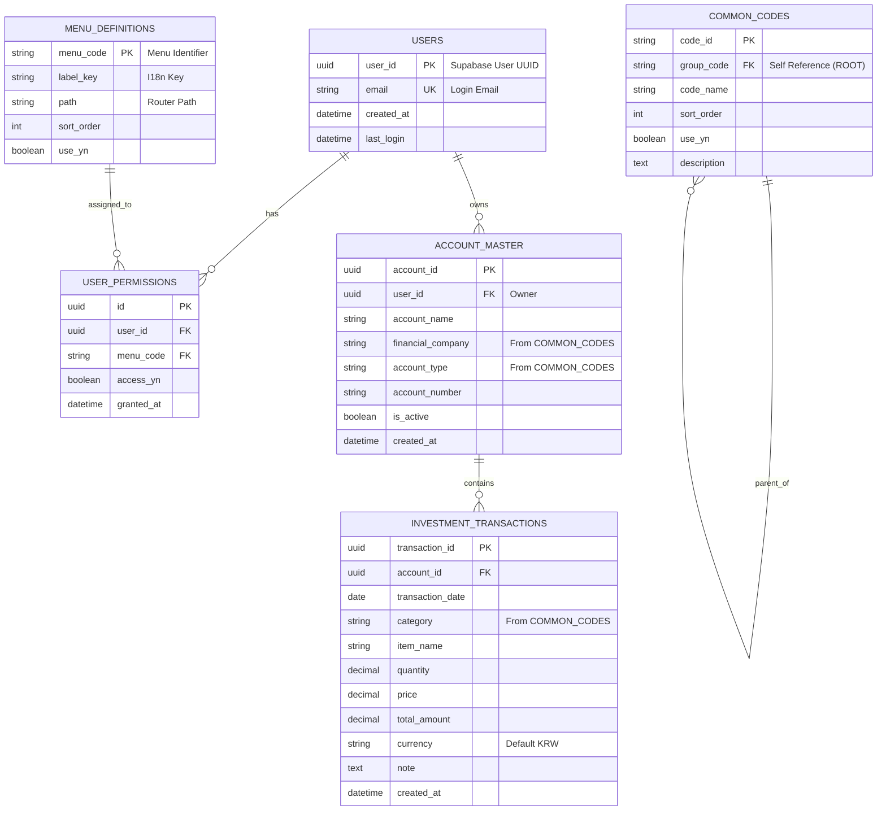

# ERD (Entity Relationship Diagram) - 개체 관계도

## 1. 개요 (Overview)
본 문서는 **사용자 인증, 투자 관리, 기준정보 관리** 시스템의 데이터베이스 설계를 시각화한 것입니다.
논리적(Logical) 설계와 물리적(Physical) 설계를 포함하며, 각 테이블 간의 관계(Relationship)를 정의합니다.

> **참고:** 현재는 Google Sheets와 Supabase가 혼용되어 있으나, 본 ERD는 **RDBMS(PostgreSQL) 마이그레이션을 가정**한 최적화된 구조를 나타냅니다.

---

## 2. 전체 통합 모델 (Integrated Model)

---

## 3. 주제 영역별 상세 모델 (Subject Area Models)

### 3.1 사용자 및 권한 모델 (Auth Model)
시스템 접근 제어를 위한 핵심 모델입니다. `USERS`와 `MENU_DEFINITIONS`는 N:M 관계이므로, 이를 해소하기 위해 `USER_PERMISSIONS` 교차 테이블을 사용합니다.

*   **USERS**: 사용자 정보 (Supabase `auth.users`와 동기화 또는 참조)
*   **MENU_DEFINITIONS**: 시스템의 모든 메뉴 목록 관리 (불변성 높음)
*   **USER_PERMISSIONS**: 특정 사용자에게 특정 메뉴 접근 권한 부여

### 3.2 투자 관리 모델 (Investment Model)
가계부 및 자산 관리를 위한 트랜잭션 모델입니다.

*   **ACCOUNT_MASTER**: 자산을 담는 그릇(계좌)입니다. `user_id`를 가져야 **멀티 유저 환경**에서도 내 계좌만 볼 수 있습니다. (현재 시트 구조엔 없지만 추가 권장)
*   **INVESTMENT_TRANSACTIONS**: 계좌 내에서 발생하는 모든 변동 내역입니다. `account_id`를 FK로 가집니다.

### 3.3 기준 정보 모델 (Reference Model)
코드 관리를 위한 재귀적 모델입니다.

*   **COMMON_CODES**:
    *   **Self-Referencing Relationship**: `group_code` 컬럼이 다시 `COMMON_CODES`의 `code_id`를 참조합니다.
    *   최상위 그룹(예: 자산유형, 은행목록)은 `group_code = 'ROOT'`를 가집니다.
    *   하위 상세코드(예: 주식, 국민은행)는 해당 그룹 코드를 부모로 가집니다.

---

## 4. 논리적 설계 고려사항 (Logical Considerations)

1.  **식별자 전략 (Keys)**
    *   모든 트랜잭션 테이블(`INVESTMENT_TRANSACTIONS`)과 마스터 테이블(`ACCOUNT_MASTER`)의 PK는 **UUID**를 사용하여 분산 환경 및 데이터 병합 시 충돌을 방지합니다.
    *   코드 테이블(`COMMON_CODES`, `MENU_DEFINITIONS`)은 가독성과 디버깅 용이성을 위해 **Natural Key (String ID)**를 사용합니다.

2.  **참조 무결성 (Foreign Keys)**
    *   `INVESTMENT_TRANSACTIONS.account_id` -> `ACCOUNT_MASTER.account_id`
        *   **On Delete Cascade**: 계좌 삭제 시 투자 내역도 함께 삭제합니다. (또는 Soft Delete 적용)
    *   `ACCOUNT_MASTER.user_id` -> `USERS.user_id`
        *   사용자 탈퇴 시 모든 자산 정보 삭제

3.  **데이터 타입 (Data Types)**
    *   금액/수량(`quantity`, `price`): 부동소수점 오차 방지를 위해 `DECIMAL` 또는 `NUMERIC` 타입을 사용합니다.
    *   여부(`use_yn`, `access_yn`): DB에서는 `BOOLEAN`이 표준이나, 기존 레거시 호환성을 위해 `CHAR(1) ('Y'/'N')`을 유지할 수도 있습니다. (본 ERD는 `BOOLEAN` 권장)
