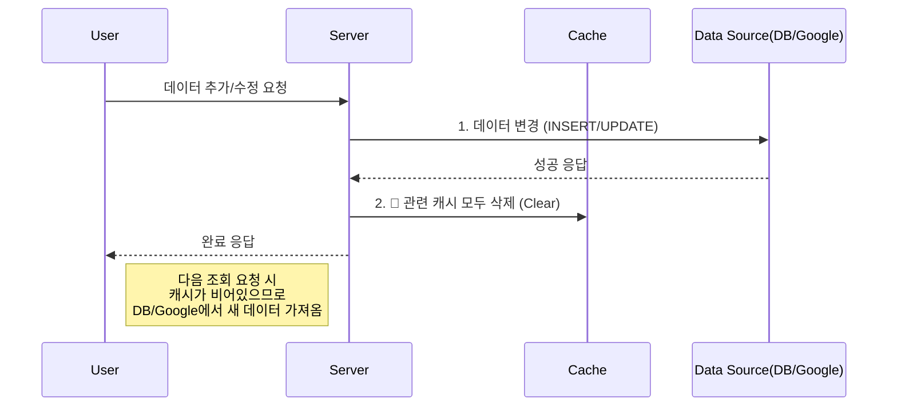
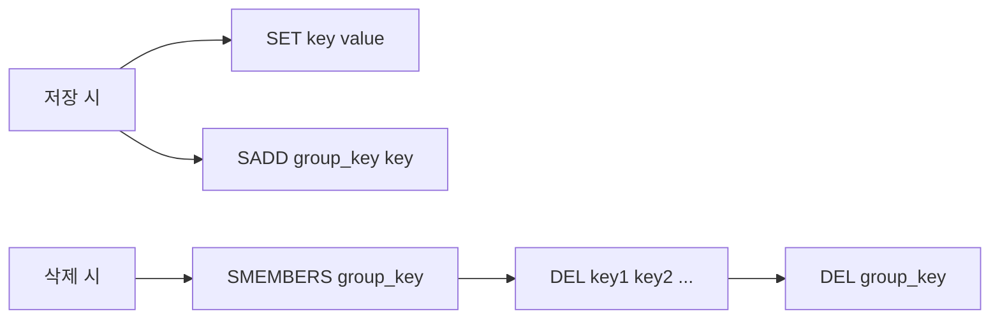

# 데이터 API 캐싱 가이드 (Data API Caching Guide)

## 1. 개요 (Overview)
본 문서는 서버의 데이터 조회 성능을 최적화하기 위한 **In-Memory Caching** 시스템의 설계 및 운영 가이드입니다. 현재는 Google Sheets API에 적용되어 있으나, 추후 Database(RDBMS) 도입 시에도 동일한 아키텍처를 유지할 수 있도록 설계되었습니다.

*   **목적:** 데이터 소스 접근 비용(API Quota, DB I/O) 절감 및 응답 속도 향상
*   **방식:** 서버 메모리(Map)에 Key-Value 형태로 데이터 임시 저장
*   **전략:** Write-Through (변경 시 즉시 무효화), TTL(Time-To-Live) 만료 시 갱신

---

## 2. 캐시 동작 프로세스 (Workflow)
데이터 소스(Source)가 무엇이든 캐시 처리 흐름은 동일합니다.

```mermaid
flowchart TD
    A[클라이언트 요청] --> B{캐시 키 생성}
    B --> C{메모리에 데이터 있음?}
    
    C -- Yes (HIT) --> D{유효 시간 지남?}
    D -- No (유효함) --> E[📦 캐시된 데이터 반환]
    D -- Yes (만료됨) --> F[데이터 소스 요청\n(Google Sheets / DB)]
    
    C -- No (MISS) --> F
    
    F --> G[메모리에 데이터 저장 + 시간기록]
    G --> H[✅ 최신 데이터 반환]
```

---

## 3. 캐시 시스템 설계 (Architecture)

### 3.1 캐시 저장소 (Storage)
`server.js` 내의 `Map` 객체를 사용합니다.
*   **Max Size:** 100개 (메모리 보호를 위해 초과 시 오래된 항목 삭제)
*   **TTL:** 60초 (데이터 신선도 유지)

### 3.2 캐시 키 (Cache Key) 전략
캐시 키는 **"어떤 데이터를(Source)", "어떤 조건으로(Condition)"** 요청했는지를 고유하게 식별해야 합니다.

```text
[Source ID]  +  "_"  +  [Entity Name]  +  "_"  +  [Sorted Filter JSON]
```

*   **Source ID:** 데이터베이스 명, 스프레드시트 ID 등
*   **Entity Name:** 테이블 명, 시트 명 등
*   **Sorted Filter JSON:** 쿼리 파라미터나 필터 조건 (키 정렬 필수)

---

## 4. Google Sheets 환경 적용 (Current)

현재 구현된 시스템에서의 적용 방식입니다.

*   **Source ID:** `Sheet ID` (투자 데이터 시트 ID 등)
*   **Entity Name:** `Sheet Name` (investment_list, accounts_master 등)
*   **Data:** 시트의 전체 행(Rows) 데이터를 배열로 저장

**예시 키:**
> `1A2b3C..._investment_list_{"category":"주식"}`

### 4.1 실제 구현 예제 (Implementation Example)
`server.js`에 적용된 캐시 사용 패턴입니다.

**데이터 조회 시 (Read):**
```javascript
// 1. 키 생성 (자동 정렬됨)
const cacheKey = getCacheKey(sheetId, sheetName, filters);

// 2. 캐시 확인 및 반환
const cachedData = cache.get(cacheKey);
if (cachedData && (Date.now() - cachedData.timestamp < CACHE_DURATION)) {
    return res.json({ data: cachedData.data });
}

// 3. (캐시 없을 때) API 호출
const data = await googleSheet.getRows();

// 4. 캐시 용량 관리 및 저장
manageCacheSize(); // 100개 초과 시 오래된 것 삭제
cache.set(cacheKey, { data, timestamp: Date.now() });
```

**데이터 변경 시 (Write):**
```javascript
// 1. Google API 동작 수행 (추가/수정/삭제)
await sheet.addRow(newItem);

// 2. 반드시 캐시 청소 호출 (필수)
// 해당 시트와 관련된 모든 캐시를 삭제하여 정합성 유지
clearCache(sheetId, sheetName);
```

---

## 5. Database(DB) 환경 확장 가이드 (Future)

추후 MySQL, PostgreSQL 등 RDBMS로 마이그레이션할 때도 본 캐시 모듈을 그대로 재사용할 수 있습니다.

### 5.1 구조적 매핑 (Structural Mapping)
Google Sheets와 Database는 저장 구조만 다를 뿐, 캐싱 관점에서는 동일한 객체입니다.

| 구분 | Google Sheets API | Database (SQL) |
| :--- | :--- | :--- |
| **데이터 소스** | Spreadsheet Document | Database Instance |
| **저장 단위** | Sheet (시트) | Table (테이블) |
| **조회 조건** | Filter Object (JS) | WHERE Clause (SQL) |
| **식별자(Key)** | `SheetID` + `SheetName` | `DBName` + `TableName` |
| **데이터 형태** | Array of Rows | ResultSet (Rows) |

### 5.2 DB 적용 시나리오
DB 도입 시 `server.js`의 데이터 소스 호출 부분만 변경하면 됩니다.

**[AS-IS] Google Sheets:**
```javascript
// 캐시 Miss 시
const doc = new GoogleSpreadsheet(sheetId, auth);
const sheet = doc.sheetsByTitle[sheetName];
const rows = await sheet.getRows(); // API 호출
```

**[TO-BE] Database (ex: PostgreSQL):**
```javascript
// 캐시 Miss 시
const query = `SELECT * FROM ${tableName} WHERE category = $1`;
const result = await db.query(query, [filters.category]); // DB 쿼리
const rows = result.rows; 
```
> **핵심:** 데이터를 가져오는 `await` 부분만 바뀌고, `cache.get()`, `cache.set()` 로직은 100% 동일하게 유지됩니다.

### 5.3 DB 환경에서의 데이터 무효화 (Invalidation)
DB 사용 시 데이터 무효화 로직도 동일합니다. 테이블에 `INSERT`, `UPDATE`, `DELETE`가 발생하면 해당 테이블과 관련된 캐시를 비웁니다.

**데이터 변경 시 캐시 무효화 흐름:**



```javascript
// DB에 데이터 추가
await db.query('INSERT INTO investment_list ...');

// 캐시 청소 (Google Sheets 때와 동일)
// "investment_list" 테이블과 관련된 모든 캐시 삭제
clearCache('my_db', 'investment_list'); 
```

---

## 6. 확장 아키텍처 (Advanced) - 구현 가이드

서비스 규모가 커지거나 서버가 다중화(Scale-out)될 경우, 현재의 In-Memory 방식은 한계가 있습니다. 이를 해결하기 위한 **Redis 도입 가이드**입니다.

### 6.1 Redis 도입 (Distributed Cache)

서버 간 캐시 공유를 위해 Redis를 사용할 때의 구현 패턴입니다.

**1. 패키지 설치:**
```bash
npm install redis
```

**2. Redis 연결 및 Wrapper 구현:**
```javascript
import { createClient } from 'redis';

const client = createClient({ url: 'redis://localhost:6379' });
await client.connect();

// JSON 직렬화/역직렬화 자동 처리
const redisCache = {
  get: async (key) => {
    const data = await client.get(key);
    return data ? JSON.parse(data) : null;
  },
  set: async (key, value, ttl = 60) => {
    // EX: 만료시간(초) 설정
    await client.set(key, JSON.stringify(value), { EX: ttl });
  }
};
```

**3. 기존 코드 변경 (Map → Redis):**
```javascript
// [AS-IS] Map
const cached = cache.get(cacheKey);

// [TO-BE] Redis (비동기 처리 주의)
const cached = await redisCache.get(cacheKey);
```

### 6.2 데이터 무효화 (Invalidation) 전략 - Redis용

Redis는 `Map`처럼 `key.startsWith()`로 검색해서 *일괄 삭제하는 기능이 느리거나(SCAN) 권장되지 않습니다(KEYS).* 따라서 **Set(집합)** 자료구조를 활용해 그룹 관리를 해야 합니다.

**구현 전략 (Grouping):**
1.  데이터 저장 시: `캐시 데이터(String)`와 `그룹 관리용 Set` 두 곳에 저장
2.  데이터 조회 시: `String`에서 조회
3.  데이터 변경 시: `Set`에 저장된 모든 키를 조회하여 `DEL` 명령으로 삭제



**예제 코드:**
```javascript
const groupKey = `group:${sheetId}_${sheetName}`;

// [저장]
await client.set(cacheKey, JSON.stringify(data), { EX: 60 });
await client.sAdd(groupKey, cacheKey); // 그룹에 키 등록

// [삭제 - 데이터 변경 시]
const keys = await client.sMembers(groupKey);
if (keys.length > 0) {
    await client.del([...keys, groupKey]); // 데이터와 그룹 정보 동시 삭제
}
```

### 6.3 쿼리 레벨 캐싱 (Query Level Caching)

DB 사용 시 복잡한 쿼리나 범위를 특정하기 어려운 경우, **SQL 문 자체를 키로 변환**하여 사용합니다.

*   **Key 생성:** SQL 문자열 + 파라미터를 해시(SHA-256 등)하여 고유 키 생성
*   **장점:** 어떤 복잡한 JOIN 쿼리라도 고유하게 식별 가능
*   **단점:** "관련 테이블이 변경되었을 때" 어떤 해시 키를 지워야 할지 추적하기 어려움 (Table 단위 무효화 권장)

```javascript
import crypto from 'crypto';

const generateQueryKey = (sql, params) => {
  const hash = crypto.createHash('sha256');
  hash.update(sql + JSON.stringify(params));
  return `query:${hash.digest('hex')}`;
};
```

---

## 7. 결론
본 캐싱 시스템은 데이터 소스(`Google Sheets` vs `DB`)에 의존하지 않는 **"응답 데이터 캐싱(Response Caching)"** 패턴을 따르고 있습니다. 따라서 향후 백엔드 인프라가 변경되더라도 핵심 로직을 그대로 유지하며 확장할 수 있습니다.
