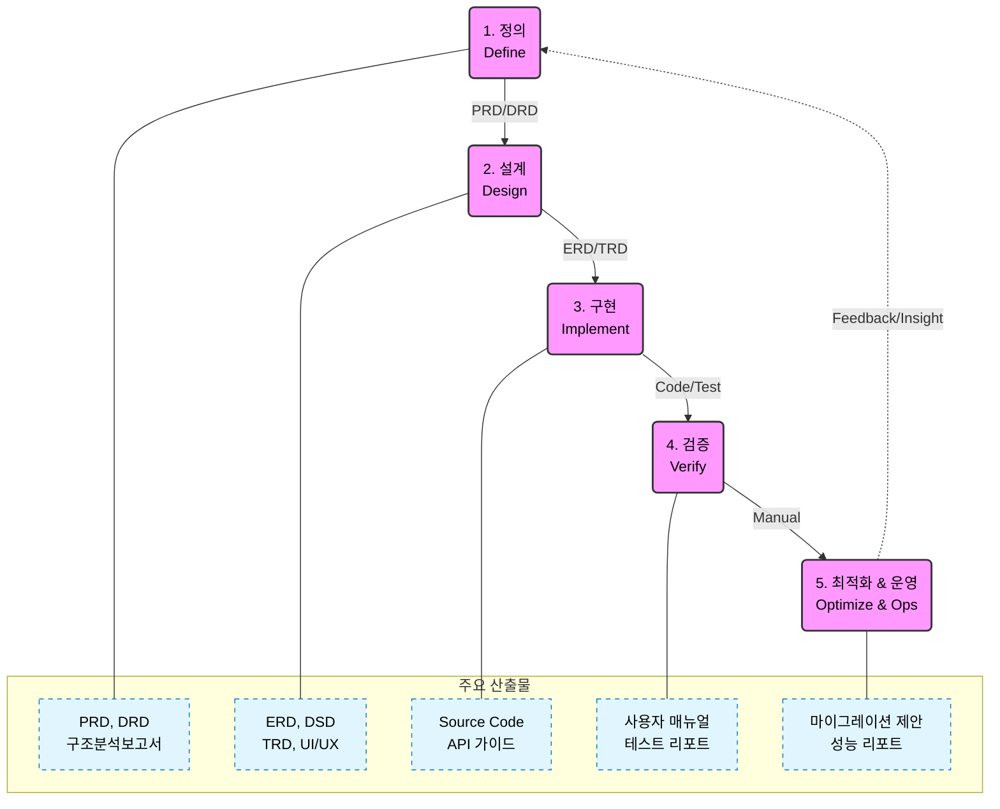
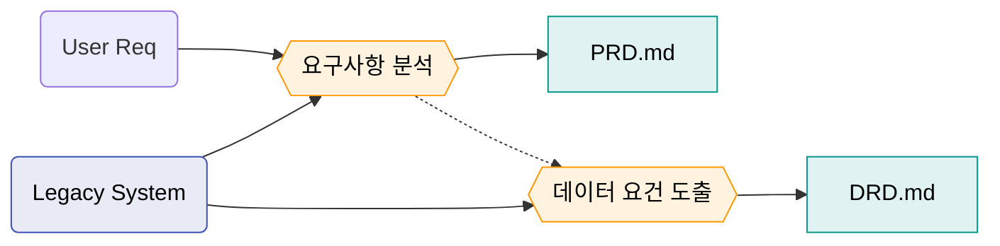
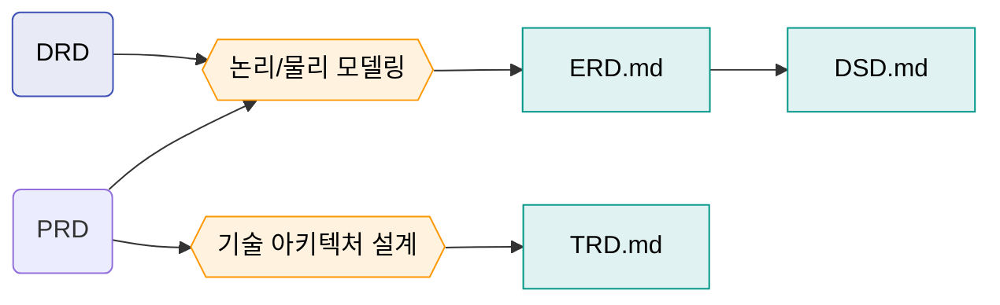
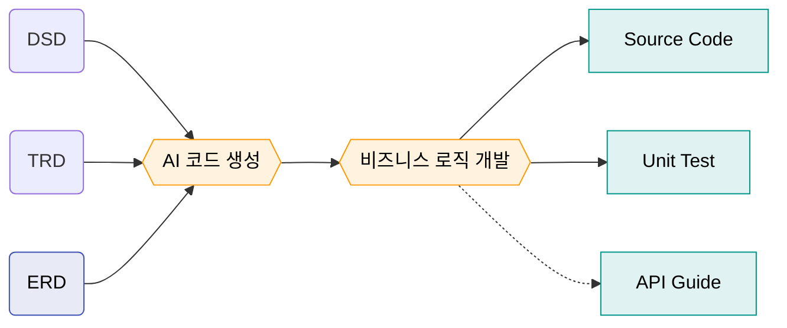
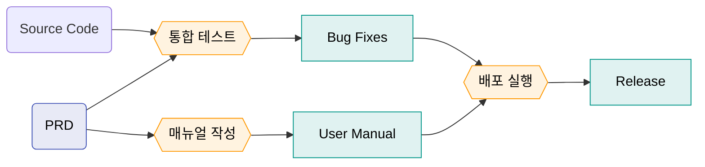
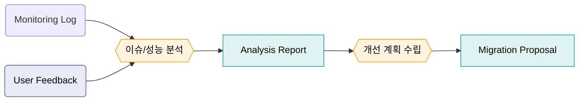
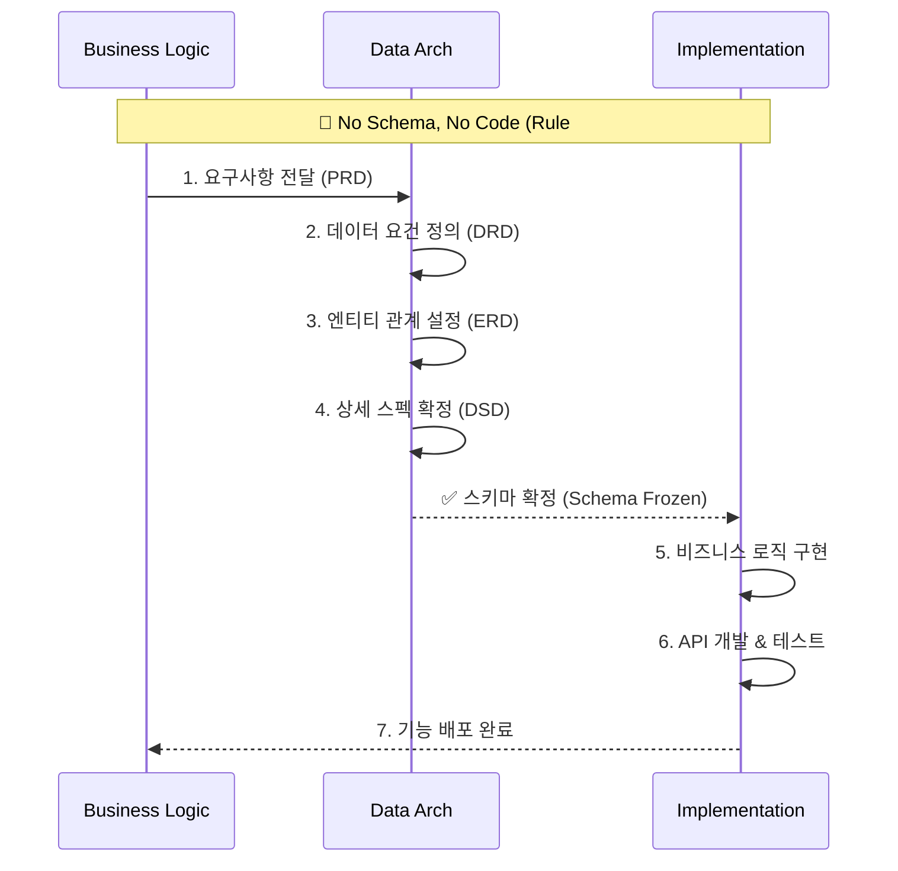
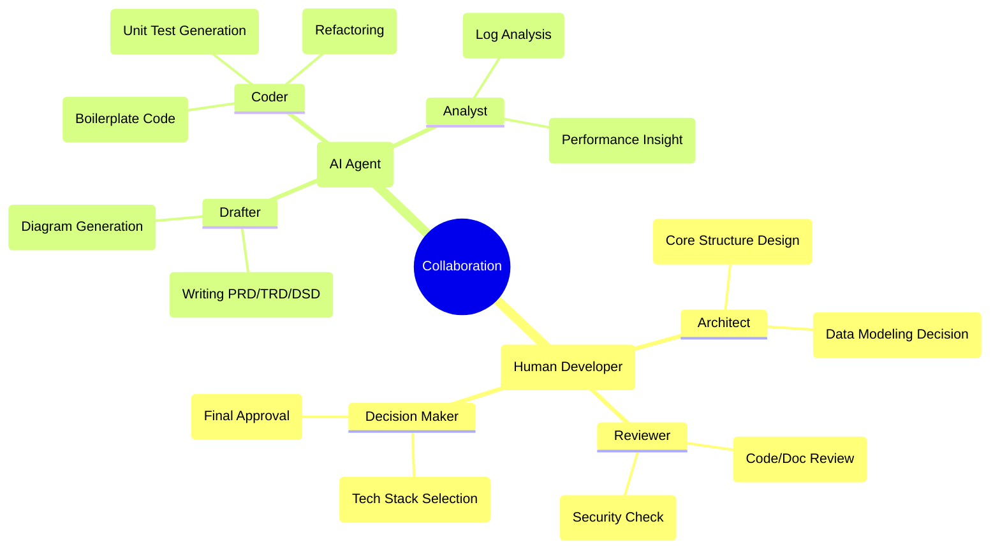
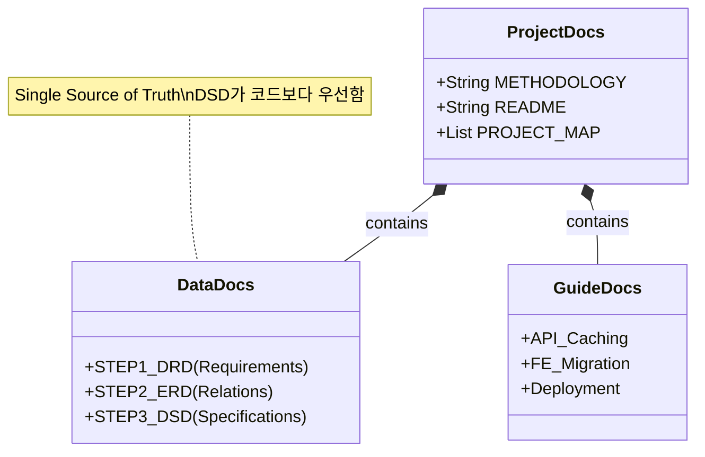

# DonMany 개발 방법론 (Development Methodology)

## 1. 개요 (Overview)
**DonMany 프로젝트**는 데이터의 무결성과 구조를 최우선으로 하는 **데이터 주도(Data-Driven)** 접근 방식과, 생성형 AI를 적극 활용하는 **AI 협업(AI-Augmented)** 개발 프로세스를 채택하고 있습니다.

### 핵심 철학 (Core Philosophy)
1.  **No Schema, No Code:** 데이터 설계(DSD, ERD)가 확정되지 않으면 비즈니스 로직 코드를 작성하지 않습니다.
2.  **Define Before Build:** 모든 기능은 요구사항(PRD)과 기술 설계(TRD)가 선행되어야 합니다.
3.  **AI as a Partner:** 반복적인 작업과 초안 작성은 AI에게 위임하고, 개발자는 **설계(Design), 검토(Review), 의사결정(Decision)**에 집중합니다.

---

## 2. 개발 생명주기 (SDLC Pipeline)

본 프로젝트는 다음 5단계의 순환 프로세스를 따릅니다. 각 단계는 이전 단계의 산출물을 입력(Input)으로 받아 다음 단계의 산출물을 출력(Output)합니다.

### 🗺️ 상세 전체 프로세스 맵 (Detailed E2E Process Map)
프로젝트의 전체 생명주기(Lifecycle)와 각 단계별 상세 활동, 그리고 산출물의 흐름을 시각화한 통합 다이어그램입니다.
*   **가로 흐름 (➡):** 각 단계 내의 상세 프로세스 진행
*   **세로 흐름 (⬇):** 다음 개발 단계로의 전환

```mermaid
graph TD
    %% 스타일 정의
    classDef step fill:#e1f5fe,stroke:#01579b,stroke-width:2px;
    classDef doc fill:#fff9c4,stroke:#fbc02d,stroke-dasharray: 5 5;
    classDef decision fill:#fff3e0,stroke:#e65100,stroke-width:2px,rhombus;

    %% 1. Define Phase
    subgraph Phase1 [1. Define: 무엇을 만들 것인가?]
        direction LR
        S1_Start((Start)) --> S1_Req[요구사항 수집]
        S1_Req --> S1_DataCheck{기존 데이터<br/>존재 여부?}
        S1_DataCheck --Yes--> S1_Report[AS-IS 분석]
        S1_DataCheck --No--> S1_NewReq[신규 요건 정의]
        S1_Report & S1_NewReq --> D1(PRD / DRD):::doc
    end

    %% 2. Design Phase
    subgraph Phase2 [2. Design: 어떻게 구조화할 것인가?]
        direction LR
        D1 --> S2_Model[데이터 모델링]
        S2_Model --> D2_ERD(ERD):::doc
        D2_ERD --> S2_Spec[상세 명세 작성]
        S2_Spec --> D2_DSD(DSD / TRD):::doc
        D2_DSD --> S2_Freeze{Schema<br/>확정?}
    end

    %% 3. Implement Phase
    subgraph Phase3 [3. Implement: 어떻게 구현할 것인가?]
        direction LR
        S2_Freeze --Yes--> S3_Guide[개발 가이드 참조]
        S3_Guide --> S3_Code[비즈니스 로직 구현]
        S3_Code --> S3_TestCode[단위 테스트 작성]
        S3_TestCode --> C1(Source Code):::doc
    end

    %% 4. Verify Phase
    subgraph Phase4 [4. Verify: 제대로 동작하는가?]
        direction LR
        C1 --> S4_Deploy[배포 파이프라인]
        S4_Deploy --> S4_Test{통합 테스트<br/>성공?}
        S4_Test --No--> S3_Code
        S4_Test --Yes--> S4_Manual[매뉴얼 작성]
        S4_Manual --> R1(Manual / Release):::doc
    end

    %% 5. Optimize Phase
    subgraph Phase5 [5. Optimize: 어떻게 발전시킬 것인가?]
        direction LR
        R1 --> S5_Mon[운영 모니터링]
        S5_Mon --> S5_Insight{개선 필요?}
        S5_Insight --Yes--> P1(Migration Proposal):::doc
        S5_Insight --No--> S5_Mon
    end

    %% Feedback Loop
    P1 -.-> S1_Req
```

### 📌 1단계: 정의 (Define)
**"무엇을 만들 것인가?"**

*   **Method:** AI를 활용한 요구사항 도출 및 현행 시스템 분석
*   **Input:** 사용자 요구사항, 현행 시스템 코드/데이터
*   **Deliverables:** `*_PRD.md`, `DATA_ARCH_DRD.md`

#### 📋 업무 체크리스트 (Tasks)
| 구분 | 업무 내용 | 산출물 |
| :---: | :--- | :--- |
| **필수** | **핵심 기능 요구사항 정의 (PRD)** | `REQ_[기능]_PRD.md` |
| **필수** | **데이터 비즈니스 요건 정의 (DRD)** | `REQ_DATA_요구사항_DRD.md` |
| 선택 | 현행 시스템 구조 분석 (AS-IS) | `PLAN_COM_구조분석_REPORT.md` |
| 선택 | 프로젝트 로드맵 수립 | `PLAN_COM_로드맵.md` |

### 📐 2단계: 설계 (Design)
**"어떻게 구조화할 것인가?"**

*   **Method:** 데이터 모델링(Logical/Physical) 및 아키텍처 수립
*   **Input:** PRD, DRD
*   **Deliverables:** `DATA_ARCH_ERD.md`, `DATA_ARCH_DSD.md`

#### 📋 업무 체크리스트 (Tasks)
| 구분 | 업무 내용 | 산출물 |
| :---: | :--- | :--- |
| **필수** | **논리/물리 데이터 모델링 (ERD)** | `ARCH_DATA_개체관계도_ERD.md` |
| **필수** | **테이블/컬럼 상세 명세 (DSD)** | `ARCH_DATA_데이터명세서_DSD.md` |
| **필수** | **기술 구현 설계 (TRD)** | `ARCH_[기능]_설계_TRD.md` |
| 선택 | 사용자 경험/화면 설계 (UI/UX) | `UIUX_[기능]_화면설계.md` |
| 선택 | 이기종 데이터 매핑 전략 수립 | `ARCH_DATA_매핑전략.md` |

### 💻 3단계: 구현 (Implement)
**"어떻게 코드로 옮길 것인가?"**

*   **Method:** AI 코드 생성(Co-pilot), 가이드 기반 구현
*   **Input:** TRD, DSD, ERD
*   **Deliverables:** `Source Code`, `DATA_GUIDE_*.md`

#### 📋 업무 체크리스트 (Tasks)
| 구분 | 업무 내용 | 산출물 |
| :---: | :--- | :--- |
| **필수** | **비즈니스 로직 및 API 구현** | `Source Code` |
| **필수** | **단위 테스트 코드 작성** | `*.test.js` |
| 선택 | 성능 최적화 (캐싱, 인덱싱) | `DEV_DATA_API캐싱_GUIDE.md` |
| 선택 | 공통 UI 컴포넌트 개발 | `DEV_UI_컴포넌트_GUIDE.md` |

### ✅ 4단계: 검증 (Verify)
**"제대로 동작하는가?"**

*   **Method:** 단위/통합 테스트, 매뉴얼 기반 검증
*   **Input:** Source Code, Requirements
*   **Deliverables:** `*_사용자매뉴얼.md`, `배포 가이드`

#### 📋 업무 체크리스트 (Tasks)
| 구분 | 업무 내용 | 산출물 |
| :---: | :--- | :--- |
| **필수** | **통합 테스트 및 버그 수정** | `Bug Fix Commit` |
| **필수** | **사용자 매뉴얼 작성** | `TEST_[기능]_매뉴얼_MANUAL.md` |
| **필수** | **배포 파이프라인 실행** | `Prod Deployment` |
| 선택 | 테스트 자동화 도구 구축 | `TEST_TOOL_캡처자동화.md` |

### 🚀 5단계: 최적화 (Optimize)
**"어떻게 발전시킬 것인가?"**

*   **Method:** 성능 모니터링, 리팩토링, 마이그레이션
*   **Input:** 운영 로그, 피드백
*   **Deliverables:** `MIGRATION_PROPOSAL.md`

#### 📋 업무 체크리스트 (Tasks)
| 구분 | 업무 내용 | 산출물 |
| :---: | :--- | :--- |
| **필수** | **운영 모니터링 및 장애 대응** | `Log Analysis` |
| 선택 | DB 마이그레이션 계획 수립 | `OPS_DB_마이그레이션_PROPOSAL.md` |
| 선택 | 신규 기술(MCP 등) 도입 검토 | `OPS_TECH_신기술도입_PROPOSAL.md` |

---

## 3. 데이터 중심 개발 파이프라인 (Data-Driven Pipeline)

본 프로젝트의 *가장 중요한 특징*인 **데이터 설계 우선 원칙**을 시각화한 흐름도입니다.

---

## 4. Human-AI 협업 모델 (R&R)

인간 개발자와 AI 에이전트의 역할 분담을 명확히 정의합니다.

---

## 5. 표준 및 규칙 (Standards)

### 문서 및 데이터 관리 규칙

*   **Single Source of Truth:** 모든 데이터 스키마의 기준은 `DATA_ARCH_데이터명세서_DSD.md`입니다.

### 5.2 문서 명명 규칙 (Document Naming Convention)

모든 프로젝트 산출물은 파일명만으로 **작성 시기(Step)**와 **주제(Domain)**를 파악할 수 있도록, 다음의 **4단 구조 표준**을 준수해야 합니다.

> **Format:** `[STEP]_[DOMAIN]_[DESCRIPTION]_[TYPE].md`

#### A. 구조 상세 (Structure Details)
| 순서 | 구분 | 설명 | 예시 코드 |
| :---: | :--- | :--- | :--- |
| **1** | **단계 (Step)** | SDLC의 어느 단계 산출물인가? | `PLAN`, `REQ`, `ARCH`, `DEV`, `TEST` |
| **2** | **도메인 (Domain)** | 어떤 업무 영역에 관한 것인가? | `COM`(공통), `DATA`, `INVEST`(투자), `AUTH` |
| **3** | **내용 (Desc)** | 구체적으로 어떤 내용인가? | `API캐싱`, `개체관계도`, `사용자매뉴얼` (한글 권장) |
| **4** | **유형 (Type)** | 문서의 성격/형식은 무엇인가? | `PRD`, `ERD`, `GUIDE`, `MANUAL` |

#### B. 코드 정의 (Code Definitions)
**1. 단계 코드 (Step Prefix)**
*   `PLAN` (1단계): 기획, 계획수립, 분석 보고서
*   `REQ` (1단계): 요구사항 정의 (PRD, DRD)
*   `ARCH` (2단계): 설계, 아키텍처, 모델링 (TRD, ERD, DSD)
*   `UIUX` (2단계): 화면 및 경험 설계
*   `DEV` (3단계): 개발 가이드, 컨벤션, 워크플로우
*   `TEST` (4단계): 테스트 결과, 사용자 매뉴얼
*   `OPS` (5단계): 운영, 배포, 마이그레이션 제안

**2. 유형 코드 (Type Suffix)**
*   `PRD`: 제품 요구사항 정의서
*   `TRD`: 기술 설계서
*   `ERD` / `DSD`: 데이터 모델링 산출물
*   `GUIDE`: 개발 가이드
*   `MANUAL`: 사용자 매뉴얼
*   `PROPOSAL`: 제안서

#### C. 적용 예시 (Examples)
| 기존 파일명 | **표준화 파일명 (Change To)** | 의미 |
| :--- | :--- | :--- |
| `데이터_문서_작성_계획.md` | `PLAN_DATA_문서작성계획_ROADMAP.md` | 기획 단계 / 데이터 / 로드맵 |
| `투자관리_PRD.md` | `REQ_INVEST_투자관리_PRD.md` | 요구사항 / 투자관리 / PRD |
| `DATA_ARCH_개체관계도_ERD.md` | `ARCH_DATA_개체관계도_ERD.md` | 설계 단계 / 데이터 / ERD |
| `데이터_API_캐싱_가이드.md` | `DEV_DATA_API캐싱_GUIDE.md` | 개발 단계 / 데이터 / 가이드 |
| `투자관리_사용자매뉴얼.md` | `TEST_INVEST_투자관리_MANUAL.md` | 검증 단계 / 투자관리 / 매뉴얼 |
