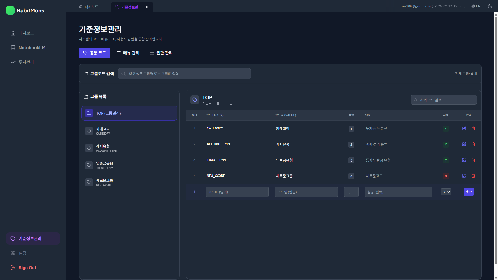
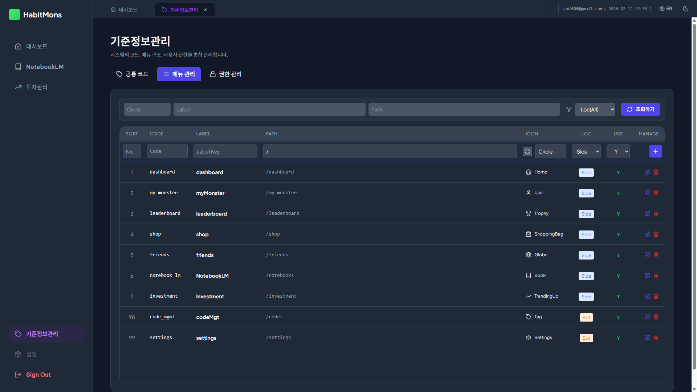
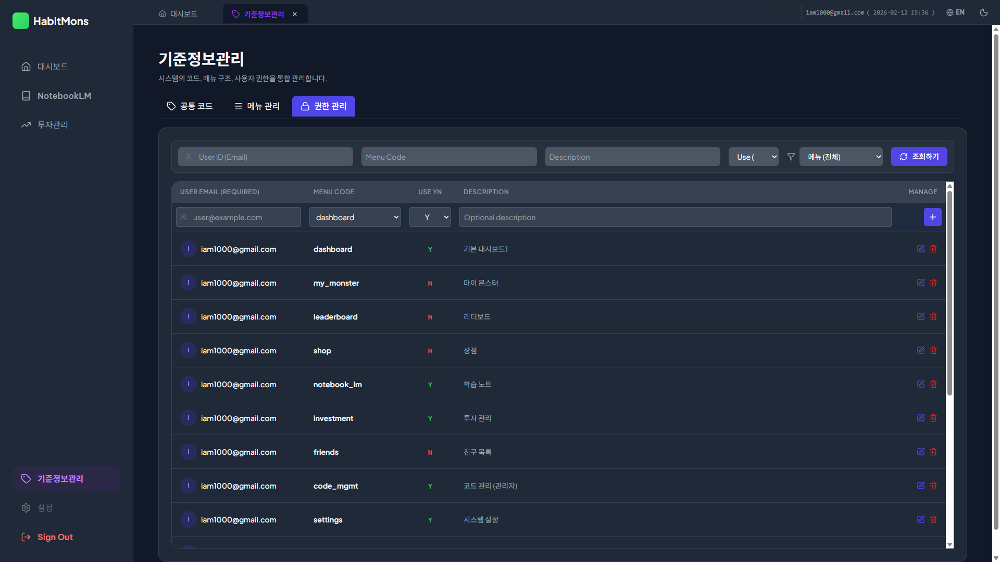

# DonMany 기준정보관리 사용자 매뉴얼

본 매뉴얼은 **DonMany** 서비스의 핵심 기준정보(공통코드, 메뉴, 권한)를 관리하는 방법을 안내합니다. 효과적인 시스템 운영을 위해 각 관리 탭의 기능을 숙지하시기 바랍니다.

---

## 1. 공통 코드 관리 (Common Code Management)

*   **화면 개요**: 시스템 전반에서 사용되는 표준 코드(예: 계좌유형, 거래구분 등)를 정의하고 관리하는 화면입니다. 코드의 변경 사항은 시스템 전체에 실시간으로 반영됩니다.
*   **주요 기능**: 그룹 코드 검색, 하위 코드 관리(CRUD), 코드 정렬 및 사용 여부 설정.
*   **상세 가이드**: 좌측의 '그룹 목록' 패널과 우측의 '하위 코드 상세' 패널로 나뉘어 있어 계층적인 코드 관리가 가능합니다.
*   **화면 사용법**:
    *   **그룹 조회**: 좌측 목록에서 그룹을 선택하거나 상단 검색창에서 그룹명/ID를 입력합니다.
    *   **코드 추가**: 우측 테이블 최상단 **입력 행**에 코드ID(영문), 코드명(한글), 정렬순서를 입력하고 `추가` 버튼을 누릅니다.
    *   **코드 수정**: 수정할 코드 행의 `📝 수정` 아이콘을 클릭하여 인라인 편집 모드에서 내용을 변경 후 저장합니다.
    *   **코드 삭제**: `🗑️ 삭제` 아이콘을 클릭하여 코드를 영구 삭제합니다. (주의: 해당 코드를 사용 중인 데이터가 있을 수 있습니다.)
*   **활용 팁**: 새로운 '계좌 유형'을 추가하고 싶다면 `ACCOUNT_TYPE` 그룹을 선택하고 하위 코드를 등록하면 됩니다.

---

## 2. 메뉴 관리 (Menu Management)

*   **화면 개요**: 네비게이션 바(Sidebar/Bottom)에 표시될 메뉴의 구조, 아이콘, 경로를 설정하는 화면입니다.
*   **주요 기능**: 메뉴 표시 순서(Sort) 지정, 아이콘 선택(Lucide Icons 연동), 표시 위치(Sidebar/Bottom) 설정.
*   **상세 가이드**: 메뉴의 추가/삭제/수정이 즉시 UI에 반영되므로, 서비스 배포 없이 유연한 메뉴 운영이 가능합니다.
*   **화면 사용법**:
    *   **메뉴 조회**: 상단 필터에서 Code, Label, Path 키워드로 검색하거나 위치별(Side/Bot)로 조회합니다.
    *   **메뉴 등록**: 최상단 입력 행에 Code, Label, Path, Icon 등을 입력하고 `➕ 추가`를 클릭합니다.
    *   **아이콘 설정**: Icon 입력난을 클릭하면 시스템에서 지원하는 아이콘 목록(Datalist)이 나타나 쉽게 선택할 수 있습니다.
*   **활용 팁**: `Sort Order` 숫자가 낮을수록 메뉴 상단(또는 좌측)에 먼저 표시됩니다.

---

## 3. 권한 관리 (Permission Management)

*   **화면 개요**: 사용자별로 특정 메뉴에 대한 접근 권한(Access)을 부여하거나 차단하는 보안 관리 화면입니다.
*   **주요 기능**: 사용자-메뉴 접근 매핑, 권한 일괄 조회, 접근 허용(Y)/차단(N) 제어.
*   **상세 가이드**: 사용자의 이메일 주소를 기준으로 권한을 관리하며, 등록되지 않은 사용자는 기본적으로 보호된 메뉴에 접근할 수 없습니다.
*   **화면 사용법**:
    *   **권한 조회**: 사용자 이메일이나 특정 메뉴 코드를 검색하여 현재 등록된 권한 현황을 파악합니다.
    *   **권한 부여**: 최상단 행에 대상자 이메일을 입력하고, 허용할 메뉴를 선택한 뒤 `Use YN`을 'Y'로 설정하여 `➕ 추가`합니다.
    *   **권한 회수**: 특정 사용자의 메뉴 접근을 막으려면 해당 권한 행의 `Use YN`을 'N'으로 수정하고 저장합니다.
*   **활용 팁**: 모든 메뉴에 접근 가능한 '슈퍼 관리자' 설정은 별도 로직으로 존재하지 않으므로, 주요 관리 메뉴에 대한 권한을 개별적으로 꼼꼼히 등록해야 합니다.

---

© 2026 DonMany. All rights reserved.
