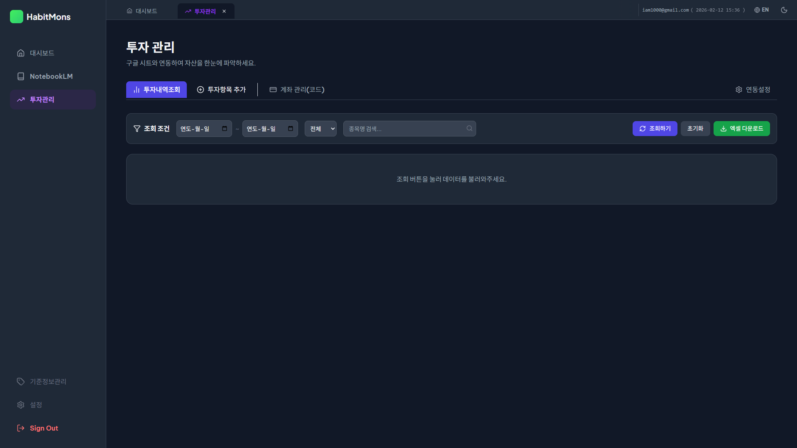
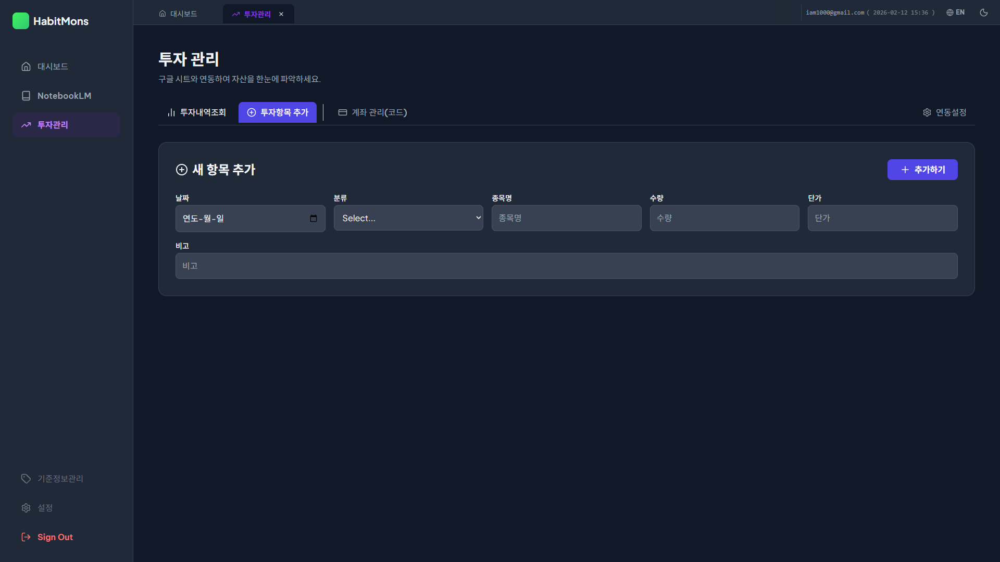
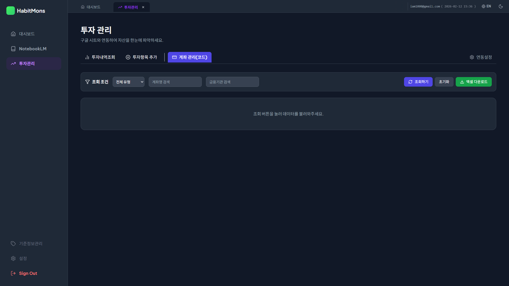
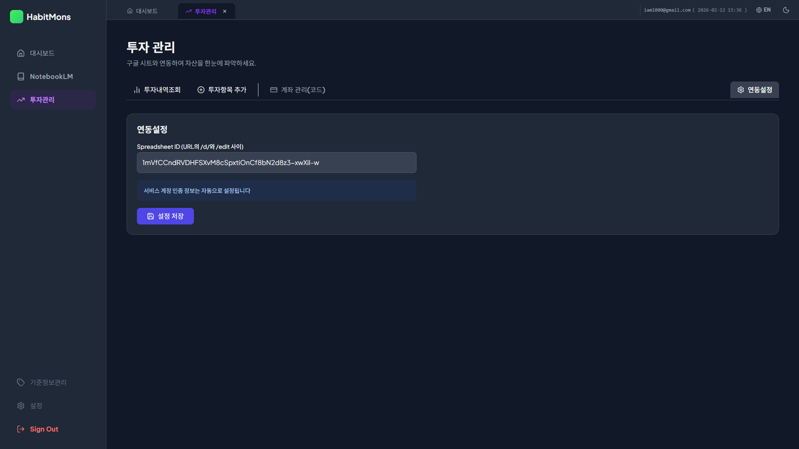

# DonMany 투자관리 사용자 매뉴얼

본 매뉴얼은 **DonMany** 투자관리 시스템의 효율적인 사용을 위해 제작되었습니다. 구글 스프레드시트와의 실시간 연동을 통해 자산을 체계적으로 관리하는 방법을 안내합니다.

---

## 1. 투자 내역 조회 (Investment List)

*   **화면 개요**: 실시간으로 기록된 모든 투자 내역을 통합적으로 모니터링하고 관리하는 메인 데이터 센터입니다.
*   **주요 기능**: 다차원 필터링(기간/카테고리), 데이터 정렬, 엑셀 출력 및 실시간 인라인 편집 기능을 제공합니다.
*   **상세 가이드**: 화면 상단의 강력한 필터바와 하단의 인터랙티브 데이터 그리드로 구성되어 있습니다. 모든 작업 내용은 구글 시트와 즉시 동기화됩니다.
*   **화면 사용법**:
    *   **내용 조회**: 상단 필터바에서 기간, 카테고리 등을 설정하고 `🔍 조회` 버튼을 클릭합니다.
    *   **데이터 입력**: 테이블 최상단의 **하늘색 입력 행**에 정보를 입력한 후 우측의 `➕ 추가` 버튼을 클릭하여 즉시 저장합니다.
    *   **데이터 수정**: 행 우측의 `📝 수정` 아이콘을 누르면 행 전체가 편집 모드로 전환됩니다. 수정 후 `💾 저장` 아이콘을 클릭합니다.
    *   **데이터 삭제**: 사용하지 않는 내역은 `🗑️ 삭제` 아이콘을 클릭하여 시트에서 즉시 제거할 수 있습니다.
*   **활용 팁**: 테이블 헤더를 클릭하여 오름차순/내림차순으로 정렬하면 자산 변동 흐름을 더 쉽게 파악할 수 있습니다.

---

## 2. 투자 내역 추가 (Add Investment)

*   **화면 개요**: 새로운 투자가 발생했을 때, 상세 정보를 집중해서 입력할 수 있는 전용 입력 폼 화면입니다.
*   **주요 기능**: 단계별 정보 입력 UI, 필수 항목 체크, 연속 데이터 저장 및 자동 화면 전환.
*   **상세 가이드**: 리스트 화면보다 넓은 입력 폼을 제공하여 오타를 방지하고 정확한 데이터를 등록하기에 가장 최적화된 화면입니다.
*   **화면 사용법**:
    *   **내용 입력**: 종목명, 날짜, 연결 계좌, 수량, 단가를 순서대로 입력합니다.
    *   **입력 기능**: 하단의 `💾 저장하기` 버튼을 누르면 데이터가 구글 시트로 전송됩니다.
    *   **결과 확인**: 저장이 완료되면 시스템이 자동으로 '투자 내역 조회' 화면으로 이동하여 등록 결과를 보여줍니다.
*   **활용 팁**: 단가와 수량을 입력하면 시스템이 자동으로 예상 투자 금액을 계산하여 관리 편의성을 높여줍니다.

---

## 3. 계좌 관리 (Account Management)

*   **화면 개요**: 자산이 예치된 금융기관과 개별 계좌 정보를 정의하고 관리하는 기초 데이터 화면입니다.
*   **주요 기능**: 계좌 유형 코드 매핑, 금융기관별 그룹화 및 검색, 인라인 정보 업데이트.
*   **상세 가이드**: 여기서 등록된 계좌가 투자 내역 입력 시 '연결 계좌' 목록으로 제공되므로, 시스템을 시작할 때 반드시 먼저 설정해야 합니다.
*   **화면 사용법**:
    *   **내용 조회**: 상단 필터에서 '전체 유형' 또는 특정 금융기관명을 입력해 기존 계좌를 조회합니다.
    *   **계좌 입력**: 최상단 입력 행에서 계좌 유형(주식, 코인 등)을 선택하고 계좌명과 기관명을 입력한 후 `➕ 추가`를 누릅니다.
    *   **수정/삭제**: 기존 계좌의 정보가 변경되거나 폐쇄된 경우 행 우측 버튼을 통해 즉시 편집하거나 삭제할 수 있습니다.
*   **활용 팁**: '코드 관리' 메뉴에서 공통 코드를 수정하면 계좌 유형 목록이 실시간으로 업데이트됩니다.

---

## 4. 연결 설정 (Connection Settings)

*   **화면 개요**: 서비스와 구글 스프레드시트 저장소를 안전하게 연결하기 위한 보안 설정 영역입니다.
*   **주요 기능**: Spreadsheet ID 등록, 브라우저 로컬 세션 영구 저장, 연동 상태 확인.
*   **상세 가이드**: 사용자의 데이터를 어디에 저장할지 지정하는 핵심 게이트웨이로, 최초 1회 설정이 필요합니다.
*   **화면 사용법**:
    *   **내용 입력**: 사용 중인 구글 시트 URL에서 추출된 전용 ID를 입력창에 정확히 입력합니다.
    *   **적용 기능**: `💾 설정 저장` 버튼을 클릭하면 설정값이 저장되어 이후 접속 시에도 자동으로 데이터를 불러옵니다.
*   **활용 팁**: 데이터 로드에 문제가 생길 경우 이 화면에서 Spreadsheet ID 값이 최신인지 가장 먼저 확인하시기 바랍니다.

---

© 2026 DonMany. All rights reserved.
